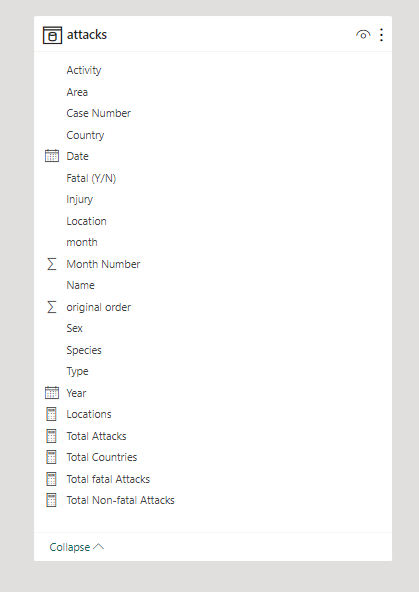

# GLOBAL SHARK ATTACKS

## Introduction
As part of my internship programme, I was handed a raw Global Shark attacks dataset to wrangle, clean, model (if necessary), analyse and generate valuable insights that could help in understanding the pattern of attacks and preventing future occurences. Power BI was used for this project and the following Power BI DAX concepts were applied

- Calculated columns
- calculated measures

## Problem Statement
It seemed like Shark attacks have intensified in the last couple of years. But:

- What is the trend like?
- What triggers these attacks?
- Which places are hotbeds for Shark Attacks?
- How can it be prevented and/or avoided going forward?

## Data Sourcing
This dataset is a single table of an excel csv file, and it contains 5763 rows and 16 columns. It came in a zipped format, I extracted the file and proceeded to import into my Power BI desktop for cleaning and visualization.

## Data transformation/Cleaning
The data was effectively cleaned on the Power Query Editor of Power BI. This was done to ensure data quality before subsequent visualization. Actions include:

- Removing duplicates
- Checked for all empty cells (null) and effectively renamed to "Unspecified".
- The dates in the date column were in different date format; I converted them to the same format.
- Duplicated the date column and renamed it "year". I further extracted the year using the format "YYYY" in the column tools
- converted all columns to the correct data types (text for text, date for date, whole numbers for whole numbers etc.)

## Data Modelling
Modelling was not necessary as the dataset was a single table 5763 rows and 16 columns. However, below is the model view with the calculated columns and new measures

## Visualization
Below is the report which is a single page dashboard

You can interact with the report [here](https://app.powerbi.com/groups/me/reports/8b5da2e6-3835-4111-b046-00b6d4b891b1/ReportSection671bb8b7525cb9b706ac?experience=power-bi)

## Conclusion 
The report showed that the last 2 decades had the highest shark attacks in history with about 73% of these total attacks being unprovoked. The White and Tiger Sharks were also identified as the two main shark specie responsible for majority of these attacks. While the summer (Hot) months of July and August recorded the higest attacks; swimming and surfing were the top 2 actvities of the vicitms just before attack. Furthermore, the coastal waters of Florida, California and Hawaii (USA), Queensland and New South Wales (Australia) as well as KwaZulu-Natal (South Africa) were summarily identified as the hotbeds for Shark attacks in the World as they recorded the highest figures.  

## Recommendation

People and tourist alike are advised to:

- Study surrounding waters before going in
- Avoid river mouths
- Go to guarded beaches
- Request more information about a beach from a life guard before going in
- Never take or wear shiny objects into the water as those shiny objects could be mistaken for a meal
